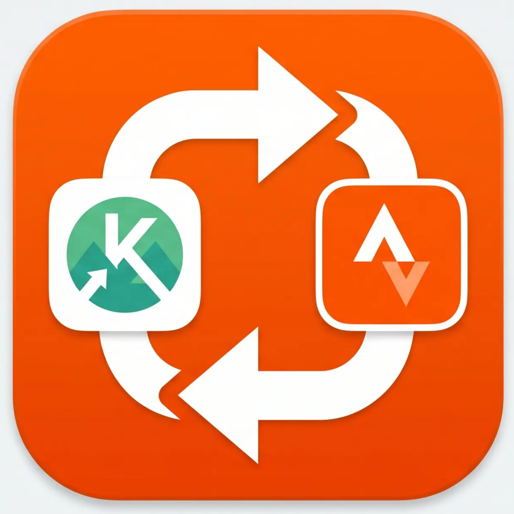

# komoot-strava-sync

<p align="center">
  
</p>

Komoot to Strava sync project with an in-progress multi-tenant backend in `backend/` and the older standalone implementation preserved in `legacy/`.

## Current State

- `backend/`: active FastAPI + PostgreSQL + Redis + ARQ codebase
- `legacy/`: old single-user implementation kept for reference
- `frontend/`: not started yet

The backend now has working API routes, jobs, tests, and a verified initial Alembic migration, but the product is still under active cleanup and completion.

## What Is Verified

- `cd backend && python -m pytest tests/ -v` passes
- `backend/alembic/versions/001_initial_schema.py` applies successfully to a clean PostgreSQL 16 database
- Strava tokens are stored encrypted and refreshed in worker paths before use
- Strava webhook events resolve users through `strava_tokens.strava_athlete_id`

## Quick Start

### 1. Create an env file

For backend development:

```bash
cp .env.saas.template .env.saas
```

For self-hosted-style backend runs:

```bash
cp .env.selfhosted.template .env.selfhosted
```

Fill in at least:

- `DATABASE_URL`
- `REDIS_URL`
- `SECRET_KEY`
- `KOMOOT_ENCRYPTION_KEY`
- `STRAVA_CLIENT_ID`
- `STRAVA_CLIENT_SECRET`

### 2. Start the backend stack

```bash
make dev
make dev-logs
```

This starts:

- `db`
- `redis`
- `api`
- `worker`

The current compose setup is backend-only. There is no frontend service in the repo yet.
`make dev` uses `docker compose --env-file .env.saas`, so it does not depend on the legacy root `.env`.

### 3. Run checks

```bash
make check
```

## Useful Commands

```bash
make status
make dev
make dev-stop
make dev-logs
make test
make lint
make check
make migrate
```

## Architecture Notes

### Backend

- FastAPI async API
- SQLAlchemy 2 async ORM
- PostgreSQL
- Redis + ARQ workers
- Strava calls guarded by `RateLimitGuard`
- Komoot credentials and Strava tokens encrypted with Fernet

### Important Constraints

- Komoot uses an unofficial API and may break unexpectedly.
- Strava rate limits are shared per app and must not be bypassed.
- Reverse sync from Strava to Komoot is only scaffolded because Komoot has no public upload API.
- Docs may lag behind code. Prefer `CODEX.md`, `AI_HANDOFF.md`, and the actual backend code when they disagree.

## Repository Guides

- `CODEX.md`: Codex workflow and repo-specific guardrails
- `CLAUDE.md`: Claude-oriented project instructions
- `AI_HANDOFF.md`: current implementation truth and recent verification history
- `PROJECT.md`: broader product and architecture planning
- `docs/setup_guide.md`: account-linking guidance for the eventual dashboard flow

## Known Gaps

- Frontend is not implemented
- Some planned endpoints are still missing
- Docs outside the files above may still contain stale references from the earlier standalone layout

## License

See [LICENSE](LICENSE).
